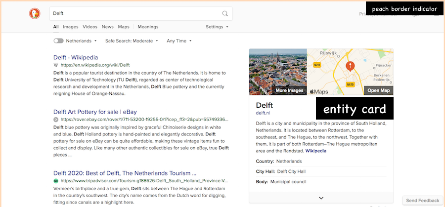
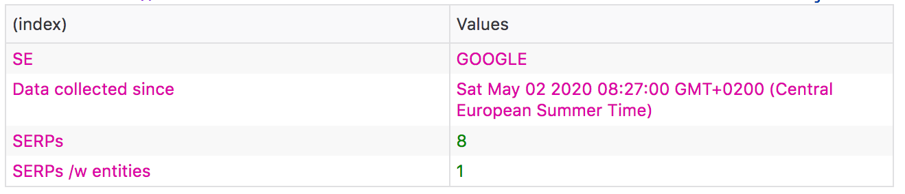

# Entity Cards Counter

A Firefox extension to quickly count the number of search engine result pages (SERPs) with/without entity cards. 

Implemented for Google, Bing and DuckDuckGo. Counts are maintained separately for each search engine.

Installation instructions for temporary add-ons are simple: clone the repository; open `about:debugging` in Firefox and click <kbd>Load Temporary Add-on</kbd>. Navigate to the `manifest.json` file and you are set.

Once the temporary add-on is installed, use Google/DuckDuckGo/Bing as usual. When the extension is triggered a small border appears around the SERP: `peachPuff` if one or more entity cards were detected, `cornflowerBlue` otherwise. The web console shows off the total counts. The data is stored in local storage, **and is lost when the browser is closed/restarted**.

SERP with an entity card from DuckDuckGo as an example:

*That doesn't seem very useful?* Right! Put together just to get an idea of how many SERPs contain an entity card during regular search sessions.

Btw, a useful resource to learn about creating extensions for Firefox is its [Extension Workshop page](https://extensionworkshop.com/).

## Detection of Entity Cards

The detection of entity cards is brittle: it depends on the detection of a particular class name:

| Search Engine     | class |
|------------|-------------------|
| Google     | `knowledge-panel` |
| DuckDuckGo | `module--about`   |
| Bing       | `b_entityTitle`   |

*This might change at any time!*

## Looking at your Counts

Head over to <kbd>Web Developer</kbd> >> <kbd>Web Console</kdbd> and conduct a search. After the SERP appears, a table that looks something like this will show up on the console:

## Bing Issues

Depending on from where you access [bing.com](https://www.bing.com) entity cards might never appear. Concretely, check out the difference between `bing.nl` and `bing.co.uk` for the query `Barack Obama` (or any other query with an entity in it).

While DDG and Google have one entity card visible on the SERP, Bing at times has several (how many depends on your definition of an entity card). Independent of the number of entity cards (beyond 1), this results in just one increment in the entity counter.